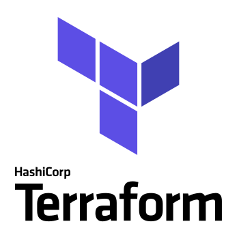

    

<h1 align="center">
    Projeto de Terraform
</h1>

<h2 align="center">
    Materiais de Estudo (Compilado por Hugo Pfeffer)
</h2>

    
    
    
    <!--  -->

 
 
<h2> Projeto </h2>

Projeto realizado com a finalidade de fixar meus conhecimentos na ferramenta Terraform. Além de servir como um 'playground' para futuros projetos na plataforma AWS.

 
<h2>Conteúdo aprendido</h2>
<h3><a href="https://www.terraform.io">Terraform</a></h3>
<ul>
    <li>Provisionar instancias em diferentes regiões da AWS</li>
    <li>Utilizar variáveis</li>
    <li>Gerar grupos de segurança</li>
    <li>Configurar volumes</li>
    <li>Configurar e utilizar o Terraform Cloud</li>
</ul>

